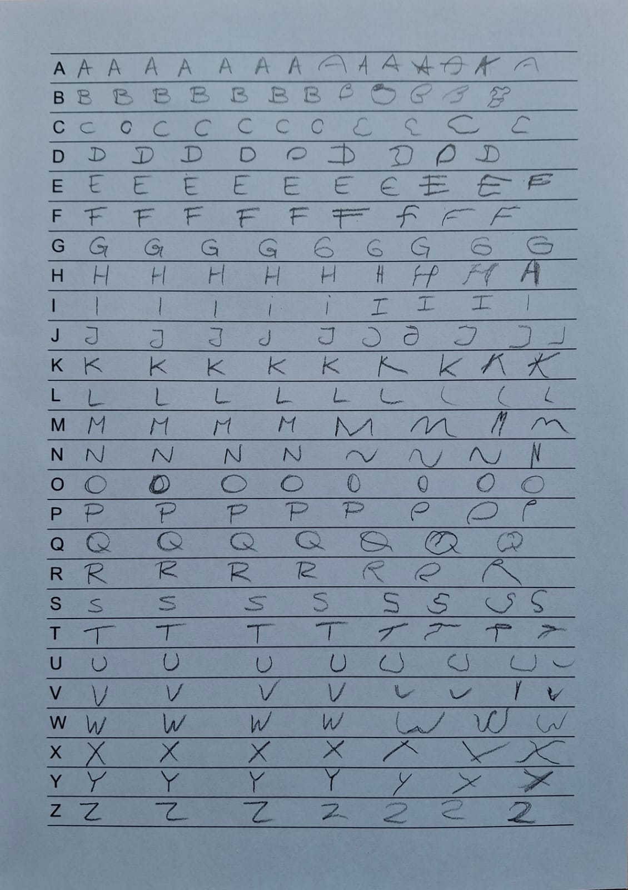
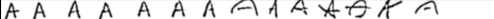

# CaligrafIA
A deep learning model made to transcribe letters from students caligraphy activities rows. Based on its prediction a new activity can be created for that particular student.
The model was trained using a synthetic dataset based on EMNIST and the IAM, CVL and RIMES datasets. 


*Example of a fictional student's calligraphy activity (written by me, not a primary school student).
The model can predict one row at a time. Therefore, for an entire page, preprocessing and postprocessing is needed.*

## Instructions for training
1. Install dependencies:
    ```
    pip install -r requierements.txt
    ```

2. Download IAM, CVL and RIMES datasets from their respective websites:   
    - IAM: https://fki.tic.heia-fr.ch/databases/iam-handwriting-database
    - CVL: https://cvl.tuwien.ac.at/research/cvl-databases/an-off-line-database-for-writer-retrieval-writer-identification-and-word-spotting/
    - RIMES: https://zenodo.org/records/10812725

    > **NOTE:** The program takes care of downloading the EMNIST dataset using the Tensorflow Datasets library.


3. Duplicate the .env.example file, rename it to .env and change the paths where the dataset's root folder is located in your computer.

4. Set the percentaje of images used for the training, validation and test splits in the `TRAIN_SPLIT` and `VAL_SPLIT` variables in the .env file

5. Preprocess the images of the datasets executing the command inside /src:
    ```
    python augment.py
    ```
    > **NOTE:** The preprocessing includes changing the image format to PNG as well as appliyng dataaugmentation techniques. This will create a new folder inside the datasets' root folder with augmented copies for each image and their corresponding labels.

6. Configure the dataset broker for training in the configure_datasets() function in main.py. There you can register which splits of each dataset are used for training, validation and testing and if dataaugmentation should be used.


7. Execute the following command inside /src to train the model:
    ```
    python main.py --mode train
    ``` 

### Outputs
A folder structure will be created to store the command's outputs:<br>
```
\model
    \info
    \plots
    \snapshots
```
After each epoch the training and validation metrics are stored in model/info/summary.csv. A snapshot of the trained model is also saved in model/snapshots/latest.keras. Execute the command shown in 6 to continue training from that model.<br>
During training, if a model archieves better validation character error rate (CER), a snapshot is saved inside model/snapshots with the name "valCER(m)-epoch(n).keras" where (m) is the validation CER archieved by the model and (n) is the epoch in which the model archieved that result.<br>

## Testing the model
To test the model using the test split execute the command: 

```
python main.py --mode test --load <saved_model_file>
```
where saved_model_file is the name of a saved model located inside model/snapshots.

### Outputs
Inside model/info:
 - **dataset_info.txt**: contains information about the percentage and amount of images used in each split. In additon, the vocabulary (characters) used is shown.
 - **trainig_metrics.txt**: contains information about the total number of epochs trained and the training and validation metrics from the best model saved.

Inside model/plots, the training and validation metrics, stored in model/info/summary.csv, are plot for each epoch.

## Commands Summary
`python augment.py` Creates copies of the dataset images in PNG format and applies data augmentation. <br>
`python main.py --mode train` Train the model<br>
`python main.py --mode test --load <saved_model_file>` Tests the saved model with the datasets' validation splits <br>
`python main.py --mode ds_info` Saves the datasets metrics in **dataset_info.txt** (Like the previous command) <br>

## Model Architecture
The architecture is a Recurrent Convolutional Nural Network (RCNN) taken from SimpleHTR (https://github.com/githubharald/SimpleHTR), published by [Harald Scheidl](https://github.com/githubharald), and migrated to TensorFlow 2.

**Input:** Receives a 32x512 gray scale image of a caligraphy activity row with individual letters written on it. 


**Output:** Transcription of the letters predicted by the model.
(AAAAAAhAhAkBKa)


